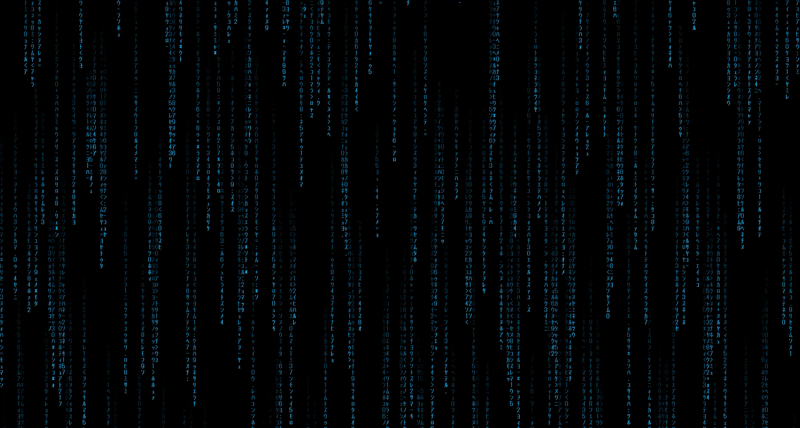

# Matrix Rain Screensaver

A digital-rain screensaver for Windows 10/11 with a full settings GUI — color,
speed, density, trail length, font size, **start delay, and lock-on-wake** —
so you never have to touch gpedit or the registry.

Multi-monitor, GPU-light, single-file C# source, and it compiles with the
C# compiler that already ships inside Windows. No Visual Studio, no SDK,
no downloads.



## Features

- Classic falling-glyph digital rain with adjustable color (hex input or picker)
- Speed, density, trail length, and font size sliders
- Works across all monitors, any resolution or orientation
- Settings GUI doubles as a control panel for Windows itself: set the
  screensaver start delay (minutes) and whether waking goes to the lock
  screen — it writes the registry for you and the settings survive reboots
- Runs as a standard `.scr`: Test, Preview, and Configure all supported
- Zero dependencies beyond .NET Framework 4, which is part of Windows

## Build

Clone or download this repo, then double-click `build.bat`.

It finds `csc.exe` (the C# compiler included with every Windows install),
compiles `MatrixRain.cs` into `MatrixRain.scr`, embeds the icon, creates a
`MatrixRainSettings.exe` twin for the settings GUI, and drops a
"Matrix Rain Settings" shortcut on your desktop.

## Install

1. Copy the screensaver into System32 (needs an admin prompt):

   ```
   copy /Y MatrixRain.scr C:\Windows\System32\
   ```

2. Double-click the **Matrix Rain Settings** desktop shortcut
3. Pick your color, set "Start after" minutes, tick "Lock screen on wake"
   if you want it, click OK

Done. The settings are written to `HKCU\Control Panel\Desktop` and persist
across reboots.

> **Note:** the binary is unsigned, so Windows Defender / SmartScreen may
> warn on first run. That's expected for any unsigned executable — you're
> building it from source yourself, which is the whole point.

> **Heads-up for managed PCs:** if your machine is enrolled in a company's
> MDM (Intune etc.), corporate lock policies override any screensaver
> settings. Ask me how I know.

## Uninstall

Delete `C:\Windows\System32\MatrixRain.scr`, pick a different screensaver
in Windows settings, and delete the repo folder.

## Configuration storage

- Appearance: `HKCU\Software\MatrixRain`
- Timing/lock behavior: `HKCU\Control Panel\Desktop`
  (`SCRNSAVE.EXE`, `ScreenSaveTimeOut`, `ScreenSaveActive`,
  `ScreenSaverIsSecure`)

## License

MIT — see [LICENSE](LICENSE).
